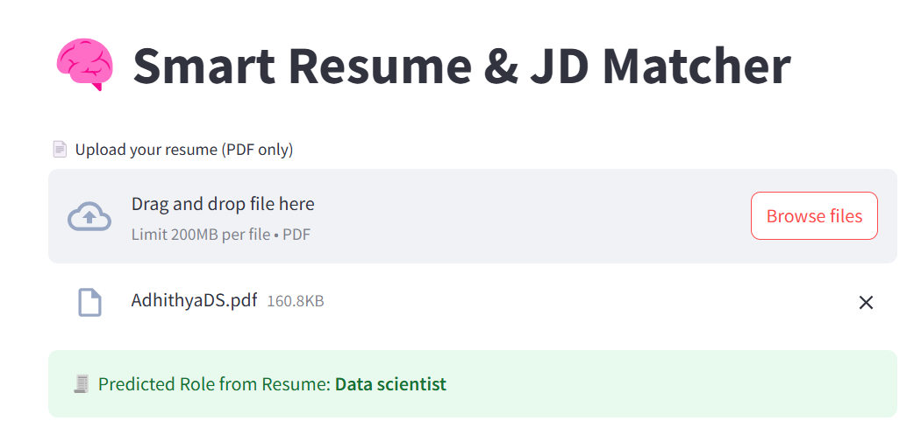
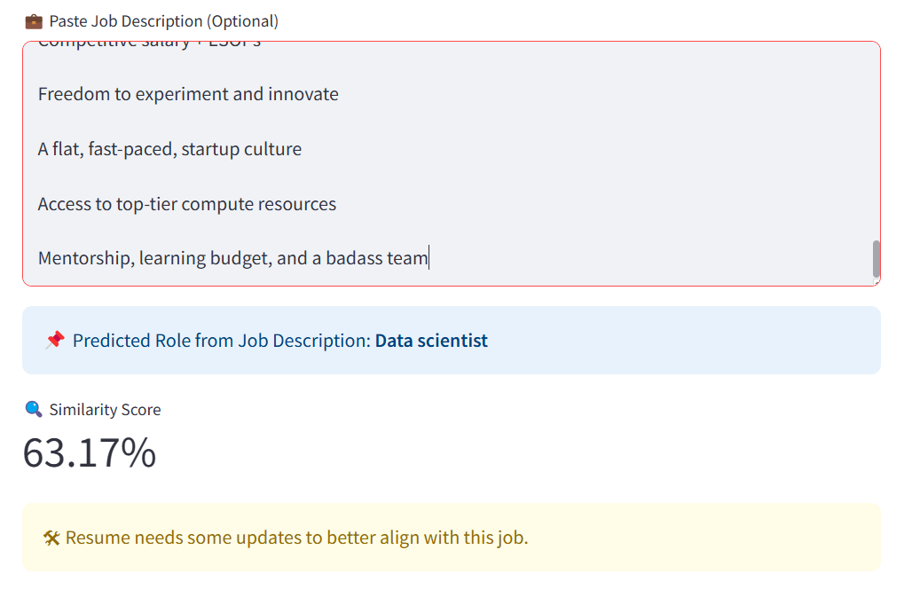

# 🧠 Resume AI Screener

An AI-powered resume screening tool that helps match candidates to the right jobs using NLP and deep learning. Upload a resume and get instant predictions about the job role it matches. Add a job description to compare and get actionable feedback on how well the resume fits the role.

---

## 🚀 Features

- 📄 Extracts text from PDF resumes using **PyMuPDF**
- 🧠 Predicts job roles using **keyword heuristics** and **transformer embeddings**
- 🔍 Compares resume content with job descriptions using **semantic similarity**
- 📈 Gives real-time feedback like:
  - `Perfect match — apply right away`
  - `Update skills to improve match`
  - `Try a different role`
- 🎨 Built with a modern, clean **Streamlit UI**

---

## 🛠 Tech Stack

- `Python`
- `Streamlit`
- `PyMuPDF (fitz)`
- `sentence-transformers` (`all-MiniLM-L6-v2`)
- `torch`

---

## 🧪 How to Run Locally

1. **Clone the repo**
   ```bash
   git clone https://github.com/your-username/Resume_Reader.git
   cd Resume_Reader

## ✅ Step 2: Install dependencies
  streamlit run resume_app.py
## ✅ Step 3: Run the App
  streamlit run resume_app.py

  
## ✅ Step 4: Upload Resume & Optional Job Description
  - On the app, upload your resume (PDF).
  - The app will instantly predict your resume’s role.
  - Paste a job description (optional).
  - It will:
    * Predict the job role from JD 🧾
    * Compare it with resume 🧠
    * Show similarity score
    * Suggest actions like:
      * ✅ Perfect match — Apply right away
      * 🛠 Update skills to improve match
      * 📄 Update your resume
      * 🔄 Try a different role

## 📸 Screenshots

### 🎯 Resume Upload & Role Prediction


---

### 🧾 Job Description Input & Similarity Score


---

### 🚧 Work in Progress: Cloud Deployment

This project currently runs **locally** using Streamlit and works as expected.

I am actively working on deploying it to **Streamlit Cloud**, which requires compatibility with specific Python package versions.

- Some dependencies (like `torch`, `PyMuPDF`) need to match Streamlit Cloud’s environment.
- Minor adjustments to `requirements.txt` and `runtime.txt` are ongoing.
- Deployment link will be updated here once stable.

_Stay tuned!_


